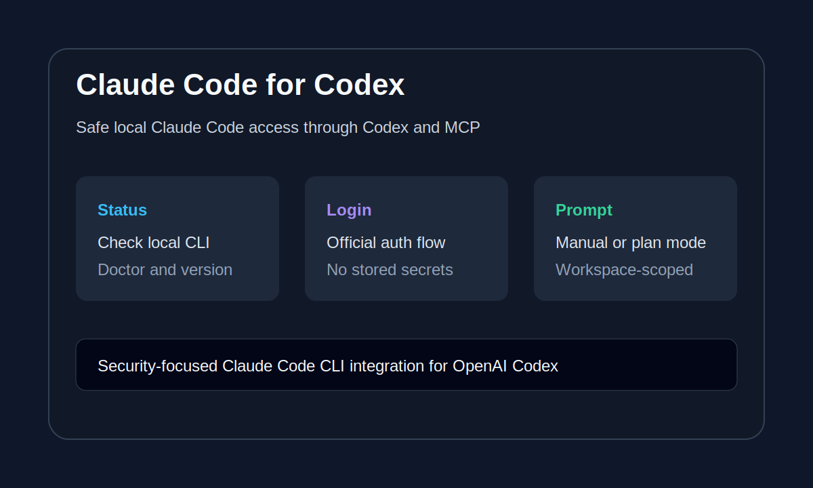

# Claude Code Codex Plugin

[](https://github.com/davidq888/claude-code-codex-plugin/actions/workflows/quality.yml)
[](https://github.com/davidq888/claude-code-codex-plugin/actions/workflows/hol-plugin-scanner.yml)

Use your local Anthropic Claude Code account from OpenAI Codex through a lightweight,
security-focused plugin. Authentication stays with the official Claude Code CLI: this plugin never
reads, copies, or stores Claude credentials.



## Why This Plugin

- **Lightweight:** one local MCP server, one skill, three tools, and no runtime dependencies.
- **Local:** Codex calls the Claude Code CLI already installed on your computer.
- **Credential-free:** login tokens and account data remain under Claude Code's control.
- **Constrained:** prompts use Claude safe mode with only `manual` and `plan` permission modes.
- **Portable:** installation and automated checks support Windows, macOS, and Linux.

## Quick Start

### Prerequisites

- Node.js 18 or newer.
- Claude Code installed and authenticated with your own Anthropic account.
- OpenAI Codex with plugin support.

### Install on any platform

```bash
git clone https://github.com/davidq888/claude-code-codex-plugin.git
cd claude-code-codex-plugin
node plugins/claude-code/scripts/install.mjs install
```

On Windows, the signed-Node PowerShell wrapper is also available:

```powershell
powershell -ExecutionPolicy Bypass -File .\plugins\claude-code\install.ps1
```

Start a new Codex task after installation and enable Claude Code from the Personal marketplace.

### Verify

Ask Codex:

```text
Check my Claude Code account status.
```

If authentication is missing or expired, ask:

```text
Open Claude Code login.
```

The official Claude Code sign-in flow opens in your browser. The plugin does not receive the
credentials entered there.

## Tools

| Tool | Purpose | Permission boundary |
| --- | --- | --- |
| `claude_code_status` | Check CLI availability, version, doctor output, and account readiness | Local diagnostic commands only |
| `claude_code_login` | Open the official Claude Code browser sign-in flow | No credential access |
| `claude_code_prompt` | Ask Claude Code for a review, plan, or second opinion | Safe mode; `manual` or `plan` only |

Example prompts:

```text
Run Claude Code on this repo in plan mode and review the current implementation.
Ask Claude Code for a second opinion about this failing test.
Draft a focused Claude Code handoff prompt for this task.
```

## Update and Uninstall

```bash
node plugins/claude-code/scripts/install.mjs update
node plugins/claude-code/scripts/install.mjs uninstall
```

The installer writes only the machine-specific Node and MCP paths required by Codex. It never
copies Claude account data.

## Security Model

- Claude Code is resolved from expected local installation paths on Windows and from `PATH` on
  macOS and Linux.
- The child process receives a small allowlist of environment variables instead of the complete
  Codex environment.
- MCP requests, prompt length, output size, runtime, and concurrency are bounded.
- Autonomous and permission-bypass modes are not exposed.
- Timed-out process trees are terminated.
- Claude authentication remains entirely in the official local CLI.

See [SECURITY.md](SECURITY.md) for reporting and trust-boundary details.

## Development

The project intentionally has no runtime or test dependencies. Run all local checks with:

```bash
npm run verify
```

GitHub Actions runs the same checks on Windows, macOS, and Linux. See
[CONTRIBUTING.md](CONTRIBUTING.md) and [CHANGELOG.md](CHANGELOG.md) for contribution and release
guidance.

## Project Scope

This plugin focuses on a small, auditable bridge between Codex and a user's local Claude Code CLI.
It intentionally does not add autonomous permission modes, credential management, persistent job
queues, or always-on hooks.

## License

[MIT](LICENSE)
